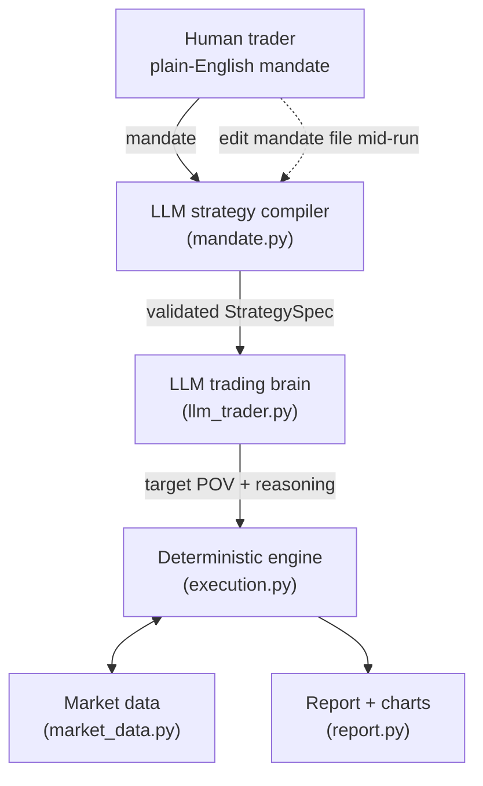

# algo_strategy_llm — Natural-Language Trading Strategies with a Local LLM

Describe an execution strategy in plain English. A local LLM compiles it into a
validated spec, paces the order bar by bar against live market state, and
explains every decision — while deterministic Python owns every hard risk
control. You can even rewrite the mandate mid-run and the strategy re-compiles
on the fly.

```
"Buy 800,000 shares over the day. Be patient and passive: prefer prices
 below VWAP, keep participation modest. Must complete by the close."
        │
        ▼  LLM strategy compiler
COMPILED SPEC: strategy=OPPORTUNISTIC | BUY 800,000 | POV cap 25% |
               limit: none | must complete: yes | urgency: low
        │
        ▼  LLM trading brain (every N minutes) + deterministic engine
[bar  30 | 10:00] pov=0.050 (passive)   -- price above VWAP, staying patient
[bar 120 | 11:30] pov=0.250 (aggressive)-- required POV near cap, must catch up
        │
        ▼
Filled 800,000 / 800,000 (100%) · Slippage vs VWAP: -13.4 bps
```

---

## Design principle

> **LLMs understand intent and explain decisions. They are never the last line
> of defense.** Creativity in the loop, determinism at the boundary.

The LLM is consulted, never trusted:

| Layer | Owner | Role |
|---|---|---|
| Strategy compiler | LLM | Plain English → JSON spec (strategy, qty, caps, limits) |
| Spec validation | Python | Clamps every field; hallucinations can't produce an unsafe spec |
| Trading brain | LLM | Sets participation/pace each decision point, one-sentence reasoning |
| Decision parsing | Python | Strips code fences, regex fallback, neutral default on garbage |
| Execution engine | Python | Hard POV cap, limit-price checks, must-complete failsafe |

## Architecture



## Requirements

- Python 3.12+
- [Ollama](https://ollama.com) running locally (`http://localhost:11434`)
- A pulled model — default is `gemma4:cloud` (change in `config.py` or via `--model`)

```powershell
python -m venv .venv-win
.venv-win\Scripts\python.exe -m pip install -r algo_strategy_llm\requirements.txt
```

Dependencies: `requests`, `matplotlib`. Optional: `yfinance` for real intraday
bars (`pip install yfinance`).

## Quick start

Run everything from the repo root (the folder containing `algo_strategy_llm/`):

```powershell
# Natural-language mandate -> compiled strategy -> full backtest + chart
python -m algo_strategy_llm.main --mandate "Sell 750k shares today, stay under 15% of volume, never below 99.50, ok to leave some unfilled"

# Canned example mandates
python -m algo_strategy_llm.main --preset urgent

# Interactive loop: type mandates, get runs and reports
python -m algo_strategy_llm.main --repl

# Classic flags, no LLM compilation (LLM still paces the order)
python -m algo_strategy_llm.main --qty 50000 --side buy

# Real market data instead of synthetic
python -m algo_strategy_llm.main --preset conservative --source yfinance --symbol AAPL
```

### Presets

| Preset | Mandate (abridged) | Exercises |
|---|---|---|
| `conservative` | Buy 400k, ≤10% of volume, prefer below VWAP, ok to underfill | POV, soft completion |
| `urgent` | Buy 1M today no matter what, cap 25% | must-complete + failsafe |
| `opportunistic` | Sell 600k in bursts above VWAP, never below 99.00, completion optional | limit price, bursty pacing |
| `steady` | Buy 500k at an even pace, ≤20%, done by close | TWAP + pace multiplier |

## Live mandate amendment

The flagship feature: a human trader can rewrite the strategy **while the order
is trading**.

```powershell
# 1. Put the mandate in a file
Set-Content live_mandate.txt "Buy 800,000 shares over the day. Be patient and passive. Must complete by the close."

# 2. Run watching the file
python -m algo_strategy_llm.main --mandate-file live_mandate.txt --decide-every 30 --seed 7

# 3. Mid-run, edit the file:
#    "URGENT: news is about to break. Buy the remaining shares as fast as
#     possible, up to the 25% cap. Speed matters more than price now."
```

At the next decision point the run prints:

```
*** MANDATE AMENDED at 13:00 (bar 210) ***
NEW MANDATE: "URGENT: news is about to break. ..."
UPDATED SPEC: strategy=POV | BUY 800,000 | POV cap 25% | must complete: yes | urgency: high
```

Amendment semantics (all enforced in code, not by the LLM):

- The compiler is told this is an **amendment to an order already trading** and
  to keep every aspect the client did not explicitly change; validation falls
  back to the *current* spec, not global defaults.
- The side cannot change mid-run (ignored with a warning).
- Quantity can never drop below what is already filled.
- The must-complete failsafe is re-evaluated under the new spec.

## The three strategies

| Strategy | Behaviour | Extra LLM output |
|---|---|---|
| `pov` | Participate in proportion to market volume | — |
| `twap` | Even schedule across the day | `pace` multiplier 0.0–2.0 |
| `opportunistic` | Low baseline, bursts when price is favourable vs arrival/VWAP | — |

The compiler picks the strategy from the mandate's language ("even pace" →
TWAP, "in bursts when the price pops" → opportunistic, otherwise POV).

## The two prompts

**1. Compiler prompt** (`mandate.py`, once per mandate + on each amendment)
— *"You are a trading-strategy compiler."* Receives the mandate verbatim and a
strict JSON schema (`strategy`, `side`, `total_qty`, `max_pov`, `limit_price`,
`must_complete`, `urgency`, `style_notes`). `style_notes` distills the client's
priorities into one instruction that follows the order all day.

**2. Decision prompt** (`llm_trader.py`, every `--decide-every` bars)
— *"You are an execution trading agent working a client order."* Contains:

- the client mandate verbatim + compiled spec,
- order state: filled/remaining, hard cap, realized participation, and the
  single most important number — **the minimum average POV needed from now on
  to complete on time** (without it, the LLM dawdles until completion is
  mathematically impossible),
- market snapshot: arrival price, last price, running VWAP, recent bars,
- strategy playbook + fill-capture rates (passive fills only ~60% of target),
- a JSON-only response schema.

Both responses are parsed defensively: markdown fences stripped, regex
fallback for malformed JSON, and a neutral 10%-POV default if nothing usable
comes back. `target_pov` is clamped to the cap **after** parsing, always.

## Engine guardrails (`execution.py`)

- **Hard POV cap** — child quantity ≤ `max_pov × bar volume`, no exceptions.
- **Limit price** — never buy above / sell below it; blocked bars are counted
  and reported.
- **Must-complete failsafe** — if the remaining quantity can no longer be done
  under the cap at average volume, the engine overrides the LLM entirely with
  cap + aggressive:
  `*** MUST-COMPLETE FAILSAFE ENGAGED ***`
- **Fill realism** — capture rate and price penalty by aggressiveness:
  passive ≈ 60% fill / 0.5 bps, neutral ≈ 90% / 2 bps, aggressive 100% / 5 bps.

## Report

Every run ends with metrics and a 3-panel PNG chart (price/VWAP/fills, volume
vs child orders, realized vs target POV):

```
  Filled:                   800,000 / 800,000 (100.0%)
  Avg fill price:           100.6124
  Day VWAP:                 100.7470
  Slippage vs VWAP:         -13.37 bps
  Implementation shortfall: +61.24 bps
  Realized participation:   16.91%
```

Sign convention: negative slippage vs VWAP = better than VWAP, for either side.

## CLI reference

| Flag | Default | Purpose |
|---|---|---|
| `--mandate TEXT` | — | compile and run a plain-English mandate |
| `--mandate-file PATH` | — | read mandate from file; edit it mid-run to amend live |
| `--preset NAME` | — | `conservative` / `urgent` / `opportunistic` / `steady` |
| `--repl` | — | interactive mandate loop |
| `--source` | `synthetic` | `synthetic` or `yfinance` |
| `--symbol` | `AAPL` | ticker for yfinance |
| `--qty`, `--side`, `--max-pov` | 50000 / buy / 0.25 | used only without a mandate |
| `--decide-every N` | 5 | consult the LLM every N bars |
| `--model` | `gemma4:cloud` | any Ollama model |
| `--seed N` | random | reproducible synthetic day |
| `--chart PATH` | `pov_report.png` | output chart |
| `--verbose` | off | print every full prompt and raw LLM response |

## Testing

Ten offline sanity checks (no Ollama needed):

```powershell
python -m algo_strategy_llm.sanity_check
```

Covers: garbage-output fallback, POV clamping, regex fallback, fenced-JSON
parsing, engine cap maths, must-complete failsafe, spec validation, amendment
field inheritance, limit-price blocking, and TWAP evenness.

## Project layout

```
algo_strategy_llm/
├── config.py        # model, guardrail ceilings, synthetic-market defaults
├── market_data.py   # synthetic GBM day w/ U-shaped volume, yfinance loader
├── ollama_client.py # thin POST wrapper with friendly error messages
├── mandate.py       # NL mandate -> validated StrategySpec (the compiler)
├── llm_trader.py    # decision prompt builder + defensive parser
├── execution.py     # deterministic engine: caps, limits, failsafe, fills
├── report.py        # metrics + 3-panel matplotlib chart
├── main.py          # CLI, presets, REPL, live-amendment loop
├── sanity_check.py  # 10 offline checks
└── requirements.txt
```

## Notes & limitations

- This is a **research/demo framework** on synthetic or historical bars — not
  a live trading system. No order routing, no exchange connectivity.
- LLM decisions are non-deterministic run to run; the feasibility number in
  the prompt stabilises behaviour, and the engine guarantees the hard limits
  regardless.
- Cloud-routed Ollama models (`*:cloud`) leave your machine; use a fully local
  model if that matters for your data.
